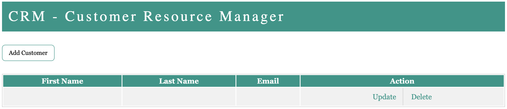
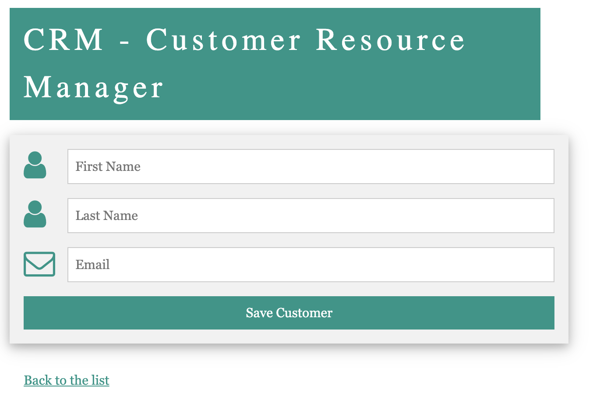

## Customer Resource Management

A java web application to do CRUD on customers. It uses spring-boot framework along with JPA and hibernate to create,
update, retrieve and delete customers.

This was a guided project completed with the help of crio.do
community. The guided project can be found at [Crio.do projects](https://www.crio.do/projects/project-crm-spring/)

  

  

